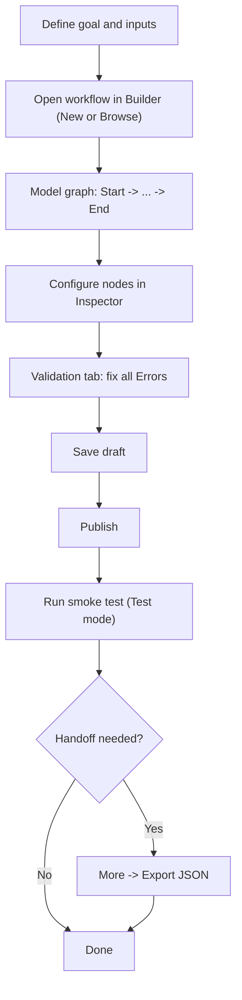

# Workflow Authoring Guide for Agents

Date: 2026-02-16
Status: Draft

## Purpose
This guide defines a strict, repeatable process for AI agents to create or update workflows in the Builder UI without breaking runtime constraints.

## When to create a workflow (and why)
Create a workflow when you need a repeatable, auditable multi-step process with explicit control flow.

Use a workflow when:
- The process has 2+ dependent steps (`Start -> ... -> End`), not a single stateless API call.
- You need branching/looping logic (`if_else`, `while`) based on runtime data.
- You need human-in-the-loop checkpoints (`interaction`, `approval`).
- You need stable run telemetry/history for operations and debugging.

Do not create a workflow when:
- The task is a one-off manual action with no reuse.
- A simple synchronous backend call is sufficient and no runtime orchestration is needed.
- Required inputs/decisions are still unknown (record TODOs first, then implement).

## Workflow objective template (mandatory before modeling)
Before opening Builder, define:
1. Business goal: what business outcome this workflow must produce.
2. Success criteria: measurable condition that means run is successful.
3. Required inputs: minimal payload expected at `Start`.
4. Final output contract: what must be available before `End`.
5. Failure policy: how failures/interrupts should be handled.

If any item is missing, add explicit TODOs and do not invent behavior.

## Process schema


## Source of truth
- Builder graph and validation rules:
  - `apps/builder/src/builder/graph.ts`
  - `apps/builder/src/builder/types.ts`
- Runtime/node behavior:
  - `docs/architecture/node-semantics.md`
  - `docs/architecture/runtime.md`
  - `docs/architecture/executors.md`
- Formal schemas:
  - `docs/api/schemas/workflow-draft.schema.json`
  - `docs/api/schemas/workflow-export-v1.schema.json`

## Workflow draft contract
Use only the supported draft shape:

```json
{
  "nodes": [{ "id": "start", "type": "start", "config": {} }],
  "edges": [{ "source": "start", "target": "end" }],
  "variables_schema": {}
}
```

Node `config.ui` (canvas position) is managed by Builder export/save logic and should not be manually invented unless importing an existing Builder JSON.

For machine validation, use:
- Draft payload: `docs/api/schemas/workflow-draft.schema.json`
- Import/export payload: `docs/api/schemas/workflow-export-v1.schema.json`

## Supported node types
- `start`
- `agent`
- `mcp`
- `if_else`
- `while`
- `set_state`
- `interaction`
- `approval`
- `output`
- `end`

Do not introduce custom node types.

## Required process (Builder UI)
1. Open/create workflow: `New` or `Browse`.
2. Define target path from objective template (`Start -> ... -> End`).
3. Build minimal path first: exactly one `Start` and at least one `End`.
4. Configure selected node in `Inspector` tab only with supported fields.
5. Add intermediate nodes from `Node palette` and connect nodes on canvas.
6. Open `Validation` tab and fix all `Error` issues.
7. Click `Save`.
8. Click `Publish` (publish is blocked when validation has errors).
9. Run smoke execution with `Run` (`Test` mode first, then `Live` if required).
10. For handoff/sharing, use `More -> Export JSON`.

## Minimum config requirements by node type
- `start`
  - `defaults` (object), optional but recommended.
  - `variables_schema` at workflow level should match expected inputs.
- `agent`
  - `instructions` should be non-empty (warning otherwise).
  - Optional operational controls: `model`, `allowed_tools`, `output_format`, `output_schema`, `state_target`, `merge_output_to_state`, `max_retries`, `timeout_s`, `emit_partial`.
- `mcp`
  - `server` and `tool` should be set (warning otherwise).
  - Optional: `arguments`, `timeout_s`, `allowed_tools`.
- `if_else`
  - `branches` must contain at least one `{ condition, target }`.
  - `else_target` is optional but recommended for deterministic routing.
- `while`
  - Required: `condition`, `max_iterations`, `body_target`, `exit_target`, `loop_back`.
- `set_state`
  - Required:
    - legacy mode: `target` and `expression`, or
    - batch mode: `assignments` with at least one `{ target, expression }` item.
  - In batch mode, assignments execute in order and later expressions can reference prior state updates.
- `interaction`
  - `prompt` should be non-empty (warning otherwise).
  - Optional: `allow_file_upload`, `input_schema`, `state_target`.
- `approval`
  - `prompt` should be non-empty (warning otherwise).
  - Optional: `allow_file_upload`, `state_target`.
- `output`
  - Use either `expression` mode or static `value`.
- `end`
  - No required config fields.

## Agent execution mode contract (live vs mock)
- Run mode values for workflow start:
  - `mode=live` maps to metadata hints: `agent_executor_mode=live`, `agent_mock=false`, `llm_enabled=true`.
  - `mode=test` maps to metadata hints: `agent_executor_mode=mock`, `agent_mock=true`, `llm_enabled=false`.
  - `mode=sync` and `mode=async` do not force mock/live; execution mode is resolved by metadata and runtime defaults.
- Agent executor resolution precedence:
  1. `run.metadata.agent_executor_mode` (`live`/`mock`)
  2. `run.metadata.agent_mock` (boolean)
  3. `run.metadata.llm_enabled` (boolean)
  4. `run.mode` fallback (`live` => live, `test` => mock) when metadata flags are not set
  5. service default executor configured by `AGENT_EXECUTOR_MODE`
- Live prerequisites:
  - OpenAI path: `OPENAI_API_KEY`, `OPENAI_MODEL`.
  - Azure OpenAI path: `AZURE_OPENAI_API_KEY`, `AZURE_OPENAI_ENDPOINT`, `AZURE_OPENAI_API_VERSION`, `OPENAI_MODEL` (deployment name).
  - If live executor is not configured, runtime fails with `Live agent executor not configured`.

## Agent structured output contract
- Use `output_schema` for structured JSON output validation.
- For JSON outputs with `output_schema`, runtime also sends schema to the model as structured
  output format (`output_type`) before post-run validation.
- JSON normalization + validation is applied when:
  - `output_format` is `json`
  - `output_format` is `json_schema` (`json-schema` / `jsonschema` aliases)
  - `output_schema` is set and `output_format` is empty (compatibility path)
- If model returns JSON as a string, runtime parses it into an object before schema validation.
- If `user_input` is omitted in an Agent node, runtime supplies default JSON context with keys:
  `input`, `state`, `node_outputs`.
- For document inputs, agents should prefer artifact-reference flow:
  - page payloads use `artifact_ref` by default;
  - default agent context should pass document metadata first;
  - full page/body content is fetched explicitly when required.
- Validated output is persisted as:
  - `node_runs[agent_node_id].output`
  - `node_outputs[agent_node_id]`
- State propagation:
  - If `state_target` is set, full Agent output is written to that path.
  - Without `state_target`, structured JSON outputs auto-merge top-level keys into state.
  - To keep output only in `node_outputs`, set `merge_output_to_state=false`.
- Recommended downstream pattern:
  - Immediately map required JSON fields with a `set_state` node (prefer one node with `assignments[]`) so numeric fields are available for later `if_else`, `output`, and `end`.
- Example category schema for travel estimate:

```json
{
  "type": "object",
  "additionalProperties": false,
  "required": ["flights", "hotel", "daily", "insurance", "buffer", "total"],
  "properties": {
    "flights": { "type": "number" },
    "hotel": { "type": "number" },
    "daily": { "type": "number" },
    "insurance": { "type": "number" },
    "buffer": { "type": "number" },
    "total": { "type": "number" }
  }
}
```

## Validation gates (must pass before publish)
Agents must ensure:
- Exactly one `Start` node.
- At least one `End` node.
- Unique node IDs.
- Every edge references existing nodes.
- There is a path from `Start` to `End`.
- All nodes are reachable from `Start`.
- `while` and `if_else` structural config is complete.
- `set_state` has either legacy `target` + `expression` or non-empty `assignments[]`.

Warnings are allowed by UI, but should be resolved unless explicitly accepted.

## Action items template (mandatory for each workflow task)
1. Define workflow goal, required inputs, and expected final output.
2. List chosen node types and planned execution path (`Start -> ... -> End`).
3. Fill node configs using only supported fields.
4. Set or confirm `variables_schema` on `Start`.
5. Connect graph and verify branch/loop targets reference real node IDs.
6. Resolve all validation errors in `Validation` tab.
7. Save draft and publish a version.
8. Run at least one smoke run in `Test` mode and verify run starts successfully.
9. Export workflow JSON and attach/store artifact if handoff is required.
10. Record explicit TODOs for any missing business inputs instead of inventing values.

## Do / Don't
- Do keep IDs stable and readable.
- Do prefer small incremental changes and republish.
- Do use `Rollback draft` if draft diverges from published version unexpectedly.
- Don't invent fields not present in Builder config schema.
- Don't publish with validation errors.
- Don't rely on hidden behavior; configure branch and loop targets explicitly.
