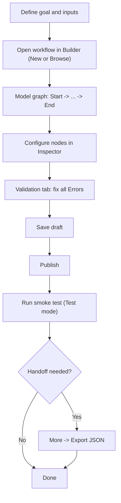

# Workflow Authoring Guide for Agents

Date: 2026-02-07
Status: Draft

## Purpose
This guide defines a strict, repeatable process for AI agents to create or update workflows in the Builder UI without breaking runtime constraints.

## Process schema


## Source of truth
- Builder graph and validation rules:
  - `apps/builder/src/builder/graph.ts`
  - `apps/builder/src/builder/types.ts`
- Runtime/node behavior:
  - `docs/architecture/node-semantics.md`
  - `docs/architecture/runtime.md`
- Formal schemas:
  - `docs/api/schemas/workflow-draft.schema.json`
  - `docs/api/schemas/workflow-export-v1.schema.json`

## Workflow draft contract
Use only the supported draft shape:

```json
{
  "nodes": [{ "id": "start", "type": "start", "config": {} }],
  "edges": [{ "source": "start", "target": "end" }],
  "variables_schema": {}
}
```

Node `config.ui` (canvas position) is managed by Builder export/save logic and should not be manually invented unless importing an existing Builder JSON.

For machine validation, use:
- Draft payload: `docs/api/schemas/workflow-draft.schema.json`
- Import/export payload: `docs/api/schemas/workflow-export-v1.schema.json`

## Supported node types
- `start`
- `agent`
- `mcp`
- `if_else`
- `while`
- `set_state`
- `interaction`
- `approval`
- `output`
- `end`

Do not introduce custom node types.

## Required process (Builder UI)
1. Open/create workflow: `New` or `Browse`.
2. Build minimal path first: exactly one `Start` and at least one `End`.
3. Add intermediate nodes from `Node palette` and connect nodes on canvas.
4. Configure selected node in `Inspector` tab only with supported fields.
5. Open `Validation` tab and fix all `Error` issues.
6. Click `Save`.
7. Click `Publish` (publish is blocked when validation has errors).
8. Run smoke execution with `Run` (`Test` mode first, then `Live` if required).
9. For handoff/sharing, use `More -> Export JSON`.

## Minimum config requirements by node type
- `start`
  - `defaults` (object), optional but recommended.
  - `variables_schema` at workflow level should match expected inputs.
- `agent`
  - `instructions` should be non-empty (warning otherwise).
  - Optional operational controls: `model`, `allowed_tools`, `output_format`, `output_schema`, `max_retries`, `timeout_s`, `emit_partial`.
- `mcp`
  - `server` and `tool` should be set (warning otherwise).
  - Optional: `arguments`, `timeout_s`, `allowed_tools`.
- `if_else`
  - `branches` must contain at least one `{ condition, target }`.
  - `else_target` is optional but recommended for deterministic routing.
- `while`
  - Required: `condition`, `max_iterations`, `body_target`, `exit_target`, `loop_back`.
- `set_state`
  - Required: `target` and `expression`.
- `interaction`
  - `prompt` should be non-empty (warning otherwise).
  - Optional: `allow_file_upload`, `input_schema`, `state_target`.
- `approval`
  - `prompt` should be non-empty (warning otherwise).
  - Optional: `allow_file_upload`, `state_target`.
- `output`
  - Use either `expression` mode or static `value`.
- `end`
  - No required config fields.

## Validation gates (must pass before publish)
Agents must ensure:
- Exactly one `Start` node.
- At least one `End` node.
- Unique node IDs.
- Every edge references existing nodes.
- There is a path from `Start` to `End`.
- All nodes are reachable from `Start`.
- `while` and `if_else` structural config is complete.
- `set_state` has both `target` and `expression`.

Warnings are allowed by UI, but should be resolved unless explicitly accepted.

## Action items template (mandatory for each workflow task)
1. Define workflow goal, required inputs, and expected final output.
2. List chosen node types and planned execution path (`Start -> ... -> End`).
3. Fill node configs using only supported fields.
4. Set or confirm `variables_schema` on `Start`.
5. Connect graph and verify branch/loop targets reference real node IDs.
6. Resolve all validation errors in `Validation` tab.
7. Save draft and publish a version.
8. Run at least one smoke run in `Test` mode and verify run starts successfully.
9. Export workflow JSON and attach/store artifact if handoff is required.
10. Record explicit TODOs for any missing business inputs instead of inventing values.

## Do / Don't
- Do keep IDs stable and readable.
- Do prefer small incremental changes and republish.
- Do use `Rollback draft` if draft diverges from published version unexpectedly.
- Don't invent fields not present in Builder config schema.
- Don't publish with validation errors.
- Don't rely on hidden behavior; configure branch and loop targets explicitly.
