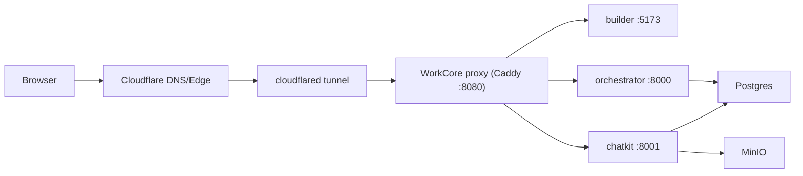

# Deployment Scheme and E2E Release Plan

## Task classification
- Type: `E` (external integration behavior: Cloudflare ingress and domain routing).
- Goal: ship safely with existing stack, using Cloudflare Tunnel as a temporary public ingress.

## Current baseline in repository
- Full local E2E runner: `./scripts/e2e_suite.sh`
  - backend run-mode E2E: `scripts/e2e_test_mode.py`
  - ChatKit interrupt/resume E2E: `scripts/chatkit_e2e.py`
  - builder Playwright E2E: `apps/builder/e2e/*.spec.ts`
- Docker deployment profile: `docker-compose.workcore.yml`
- Domain router: `deploy/docker/Caddyfile.workcore`
- Local deployment guide: `docs/deploy/docker-workcore-build.md`

## Release gates (minimum before each deploy)
1. Contract/shape sanity:
   - `./scripts/archctl_validate.sh`
2. Backend tests:
   - `./.venv/bin/python -m pytest apps/orchestrator/tests`
3. Frontend unit tests:
   - `cd apps/builder && npm run test:unit`
4. Full E2E (local domain profile):
   - `./scripts/e2e_suite.sh`
5. Public ingress smoke (through Cloudflare):
   - `curl -fsS https://api.<your-domain>/health`
   - `curl -fsS https://chatkit.<your-domain>/health`
   - `cd apps/builder && E2E_BASE_URL=https://<your-domain> E2E_API_BASE_URL=https://api.<your-domain> E2E_CHATKIT_API_URL=https://chatkit.<your-domain>/chatkit E2E_API_AUTH_TOKEN=<token> npm run test:e2e:smoke`

## E2E scope and action items
Status legend:
- `DONE`: already covered in repository
- `TODO`: add before stable production rollout

1. `DONE` Create -> publish -> run workflow (`scripts/e2e_test_mode.py`)
2. `DONE` Chat interrupt -> approve -> resume completion (`scripts/chatkit_e2e.py`)
3. `DONE` Builder workflow browse/import/export and variable picker (`apps/builder/e2e/*.spec.ts`)
4. `DONE` Builder ChatKit link generation and integration kit links (`apps/builder/e2e/chatkit-link.spec.ts`, `apps/builder/e2e/integration-kit.spec.ts`)
5. `TODO` Public-domain SSE reconnect E2E (`Last-Event-ID`) through tunnel endpoint
6. `TODO` Inbound webhook signature verification E2E through public API hostname
7. `TODO` ChatKit attachment upload/download E2E against MinIO-backed storage path
8. `TODO` Tenant isolation E2E at API level with two bearer tokens in one run
9. `TODO` Failure-path E2E (invalid token, expired signature, unknown workflow/version)

## Deployment scheme (temporary internet exposure)


## Why not quick tunnel for this stack
- Current routing is host-based in `deploy/docker/Caddyfile.workcore`.
- Builder/API/ChatKit are split by hostname.
- One random `trycloudflare.com` URL is not enough for this topology without changing routing logic.
- Use a named tunnel with three DNS hostnames mapped to the same local ingress (`http://127.0.0.1:<WORKCORE_HTTP_PORT>`).

## Cloudflare Tunnel rollout (temporary)
1. Pick hostnames:
   - `<your-domain>` for builder
   - `api.<your-domain>` for orchestrator API
   - `chatkit.<your-domain>` for ChatKit API
2. Update `.env.docker`:
   - `PUBLIC_BUILDER_HOST=<your-domain>`
   - `PUBLIC_API_HOST=api.<your-domain>`
   - `PUBLIC_API_HOST_ALT=api.<your-domain>` (optional alias accepted by proxy)
   - `PUBLIC_CHATKIT_HOST=chatkit.<your-domain>`
   - `VITE_API_BASE_URL=//api.<your-domain>`
   - `VITE_CHATKIT_PAGE=//<your-domain>/chatkit.html`
   - `VITE_CHATKIT_API_URL=//chatkit.<your-domain>/chatkit`
   - `CORS_ALLOW_ORIGINS=https://<your-domain>,https://api.<your-domain>,https://chatkit.<your-domain>`
3. Start services:
   - `./scripts/docker_up.sh`
4. Create and map tunnel:
   - `cloudflared tunnel login`
   - `cloudflared tunnel create workcore-staging`
   - `cloudflared tunnel route dns workcore-staging <your-domain>`
   - `cloudflared tunnel route dns workcore-staging api.<your-domain>`
   - `cloudflared tunnel route dns workcore-staging chatkit.<your-domain>`
5. Create `~/.cloudflared/config.yml`:
   ```yaml
   tunnel: workcore-staging
   credentials-file: /Users/<user>/.cloudflared/<tunnel-id>.json
   ingress:
     - hostname: <your-domain>
       service: http://127.0.0.1:<WORKCORE_HTTP_PORT>
     - hostname: api.<your-domain>
       service: http://127.0.0.1:<WORKCORE_HTTP_PORT>
     - hostname: chatkit.<your-domain>
       service: http://127.0.0.1:<WORKCORE_HTTP_PORT>
     - service: http_status:404
   ```
   If the public API hostname differs from `PUBLIC_API_HOST` in `.env.docker`, set host-header override:
   ```yaml
   ingress:
     - hostname: api.runwcr.com
       service: http://127.0.0.1:80
       originRequest:
         httpHostHeader: api.workcore.build
     - service: http_status:404
   ```
6. Run tunnel:
   - `cloudflared tunnel run workcore-staging`
7. Verify externally:
   - `https://<your-domain>`
   - `https://api.<your-domain>/health`
   - `https://chatkit.<your-domain>/health`

## Temporary-mode limits
- Single-host deployment and single tunnel process are SPOF.
- Keep `WORKCORE_ALLOW_INSECURE_DEV=0` for public exposure.
- Do not log secrets in browser/server logs.
- This setup is staging/pre-production friendly, not final HA production.
